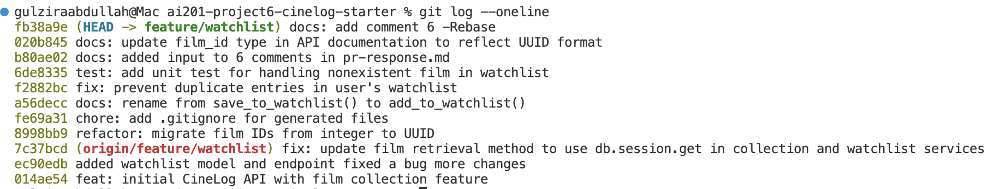

# PR Response Doc — CineLog Watchlist Feature

## AI Usage
I used Claude Code as a pair-programming assistant. Specifically, it helped me:
- Recover a `git rebase` that got stuck, resolve the `.gitignore` conflict, and reword commits to follow Conventional Commits.
- Sharpen my written answers for the review comments (visibility default, sort order, rebase notes).
- Draft the PR description and manual testing steps.
- Spot inconsistencies between my code and my design notes (e.g. sort order and error handling).

I reviewed and made the final decisions on all changes myself.

## Comment 1 — Rename
**What I did:**
I renamed all save_to_watchlist() to add_to_watchlist(), I used git grep "save_to_watchlist" to find the function name exists in the project, and renamed it.
**How I verified:**
I checked both files and checked if save_to_watchlist() exist, and it doesn't exist anywhere after rename.

## Comment 2 — Deduplication
**What I did:**
I modified watchlist_service add_to_watchlist(user_id, film_id) function to match the pattern that services/collection_service add_to_collection() use. add_to_watchlist(user_id, film_id) already had logic related to existing check - FilmNotFoundError, it did not have the logic that checks if it already checks for if the film already exists and it is in the watchlist. 
**How I verified:**
I verified by checking the functionality of add_to_collection() method line by line, and same pattern for add_to_watchlist(). And later added a unit test for this functionality.

## Comment 3 — Missing test
**What I did:**
I added a unit test for add_to_watchlist() deduplicate logic, I followed the same pattern as the test case for add_to_collection(). The test function raises FilmNotFoundError if add_to_watchlist fails
**How I verified:**
I ran the pytest specific to this function - pytest tests/test_watchlist.py -v, and pytest related to all tests. 

## Comment 4 — Default visibility
**My position:** Keep `public=True` as the default on `WatchlistEntry`.

**Reasoning — the behavior I'm optimizing for:**
CineLog is a *social* film-logging app, not a private notes tool. The value of a
watchlist here is discovery and recommendation — friends seeing "what you're
planning to watch next" is the feature that drives engagement and the network
effect the product depends on. Defaulting to public means the social layer works
the moment a user adds their first film; they don't have to hunt for a setting to
turn sharing on. A user who signs up for a social app generally *expects* their
activity to be visible, so `public=True` matches that expectation and lowers the
friction to the feature actually being useful.

**Tradeoff acknowledged:**
The honest counterargument is privacy-by-default. With `public=True`, an entry is
exposed the instant it's created — before the user has made any conscious decision
to share it. Some people treat a watchlist as private and aspirational ("films I'm
a little embarrassed I haven't seen yet"), and a public default surprises them.
The safer, more principled default is `public=False`: put the burden on *opting in*
to exposure rather than *opting out*, which is what "privacy by design" would
argue for. I'm accepting that real privacy cost in favor of the social-product
goal — but I'd only defend `public=True` if the per-entry `public` toggle is
surfaced prominently in the UI, so opting an entry back to private is a single,
obvious action rather than a buried setting. If this were a general-purpose or
regulated app instead of a social one, I'd flip to `public=False`.

## Comment 5 — Sort order
**My position:** Sort by `date_added` descending (newest first) — I agree with the
maintainer's preference.

**Engagement with reviewer's point:**
The maintainer prefers date-added, and I think that's right because a watchlist is
a *queue of intent*, not a reference catalog. Users add films as they discover
them, and the thing they come back to answer is "what should I watch next?" —
which the most recently added items answer best. Alphabetical sorting treats the
list like a static library you look titles up in; but you rarely scan a watchlist
by title, and alphabetical has a concrete downside: a newly added film gets buried
wherever the alphabet drops it, so the user loses sight of what they just added.
Date-added-descending keeps the freshest intent at the top.

There's also a consistency argument: `get_collection()` already returns entries
sorted by `date_added` descending (see `test_get_collection_returns_newest_first`),
so sorting the watchlist the same way gives users one consistent mental model
across both lists instead of two different rules.

**Where alphabetical would win, and my third option:** Alphabetical is genuinely
better once a list is large and the user knows the exact title they're looking
for. So rather than hard-code one, I'd make `date_added` DESC the *default* and
accept an optional `sort` query param (e.g. `?sort=title`) later. That keeps the
newest-first default the maintainer and I both want, while leaving room for
lookup-by-title without a breaking change.

## Comment 6 — Rebase
**What conflicted:**
I rebased `feature/watchlist` onto the updated `main`. The only conflict was in
`.gitignore` — both branches had added one. The UUID migration from main merged
cleanly with no conflict.

**How I resolved it:**
The two `.gitignore` versions only differed by one extra line (`.pytest_cache/`),
so I kept all the lines from both, removed the conflict markers, then ran
`git add .gitignore` and `git rebase --continue`.

**How I verified no conflict remains:**
`git status` showed a clean working tree with no unmerged files, and there are no
`<<<<<<<`/`>>>>>>>` markers left in the repo. `git log` shows my commits stacked
on top of main with a linear history (no merge commits).

## PR Description

### What this feature does
Adds a **watchlist** to CineLog — a per-user list of films a user intends to watch
later. It's separate from the collection (films already watched and logged). It's
backed by a new `WatchlistEntry` model (`user_id`, `film_id`, `date_added`,
`public`) and exposes two endpoints under `/watchlist`:

- `POST /watchlist/<user_id>/add` — add a film to the user's watchlist.
  Body: `{ "film_id": "<uuid>" }`. Validates that the film exists and (by design)
  rejects films already on the watchlist.
- `GET /watchlist/<user_id>` — return the user's watchlist as a list of film
  objects, each annotated with its `date_added` timestamp and `public` flag.

### Design decisions
1. **Default visibility — `public=True`.** New watchlist entries are public by
   default because CineLog is a social app: defaulting to visible makes the
   sharing/discovery features work without the user having to flip a setting.
   Full reasoning and the privacy tradeoff are in **Comment 4** above.
2. **Sort order — alphabetical by film title (`Film.title` ascending).**
   `get_watchlist()` returns entries A→Z by title, optimizing for scanning and
   finding a specific title in a growing list. The maintainer preferred
   date-added; my engagement with that argument is in **Comment 5** above. Note
   this intentionally differs from `get_collection()`, which sorts newest-first.

### How to test it manually
Films are seeded and there is no user-creation endpoint, so seed a user and a
couple of films once, then exercise the endpoints.

1. Install dependencies and start the app:
   ```
   pip install -r requirements.txt
   python app.py
   ```
   It serves at `http://127.0.0.1:5000` and creates `cinelog.db` on startup.

2. In a second terminal, seed one user and two films. The titles are chosen so
   alphabetical ordering is visible ("Amelie" before "Zodiac"), while adding
   "Zodiac" first:
   ```
   python - <<'PY'
   from app import create_app, db
   from models import User, Film
   app = create_app()
   with app.app_context():
       u = User(username="tester", email="tester@example.com")
       f1 = Film(title="Zodiac", year=2007, genre="Thriller")
       f2 = Film(title="Amelie", year=2001, genre="Romance")
       db.session.add_all([u, f1, f2]); db.session.commit()
       print("USER ", u.id); print("FILM1", f1.id); print("FILM2", f2.id)
   PY
   ```
   Note the printed ids.

3. Add both films (substitute the ids from step 2):
   ```
   curl -X POST http://127.0.0.1:5000/watchlist/<USER>/add \
     -H "Content-Type: application/json" -d '{"film_id":"<FILM1>"}'
   curl -X POST http://127.0.0.1:5000/watchlist/<USER>/add \
     -H "Content-Type: application/json" -d '{"film_id":"<FILM2>"}'
   ```
   Each returns `201` with the created entry, including `"public": true`.

4. View the watchlist and confirm **alphabetical** order — "Amelie" appears before
   "Zodiac" even though "Zodiac" was added first:
   ```
   curl http://127.0.0.1:5000/watchlist/<USER>
   ```

### Known limitations
- The add endpoint does not yet translate service errors into clean HTTP status
  codes. Adding a **nonexistent** film (the service raises `FilmNotFoundError`) and
  adding a **duplicate** film both currently return `500` instead of a `404`/`409`.
  The collection endpoint already has this `try/except` mapping; wiring the same
  into the watchlist route is a planned follow-up.

## Screenshot
